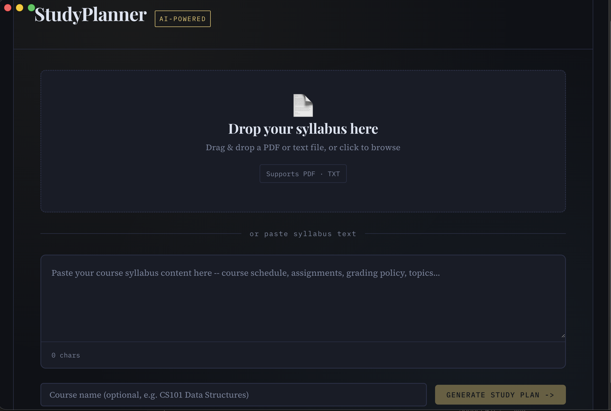
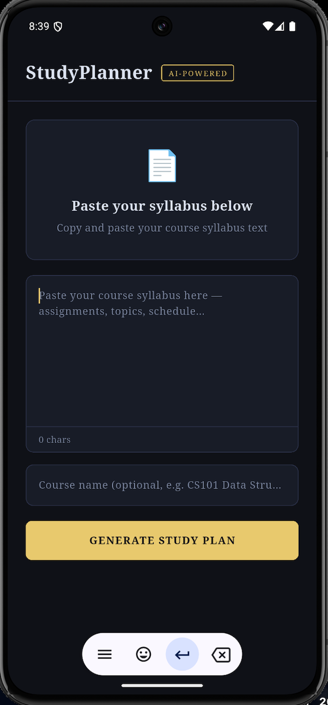

# StudyPlanner — AI Study Schedule Generator


> **Students waste hours manually reading syllabi and planning study schedules — StudyPlanner eliminates that by using AI to instantly extract deadlines and generate a personalized, day-by-day study plan from any uploaded syllabus.**

---

## Demo

> *Upload a syllabus. Get a full study schedule in seconds.*


---

## Screenshots

| Desktop (macOS) | Mobile (Android) |
|---|---|
|  |  |

---

## What it does

1. **Upload** a course syllabus as a PDF or paste the text
2. **AI extracts** all assignments, exams, deadlines, and topics automatically
3. **Generates** a realistic week-by-week, day-by-day study schedule
4. **Displays** a color-coded deadline tracker and personalized study tips

---

## Tech Stack

| Layer | Technology |
|---|---|
| Android App | Flutter 3.x + Dart |
| Desktop App | Electron + React + Vite |
| AI Model | Google Gemini 2.5 Flash API |
| Build Tool | Vite |

---

## Installation

### Prerequisites
- [Node.js 18+](https://nodejs.org)
- [Flutter SDK 3.x](https://flutter.dev)
- A free Gemini API key from [aistudio.google.com](https://aistudio.google.com)

---

### Android App (Flutter)

```bash
git clone https://github.com/Adarsh-codes2dev/study-planner.git
cd study-planner
flutter pub get
flutter run
```

Add your API key in `lib/main.dart`:
```dart
const String geminiApiKey = 'YOUR_KEY_HERE';
```

---

### macOS Desktop App (Electron)

```bash
git clone https://github.com/Adarsh-codes2dev/study-planner.git
cd study-planner
npm install
echo "VITE_GEMINI_API_KEY=YOUR_KEY_HERE" > .env
npm run dev
```

To build a distributable `.dmg`:
```bash
npm run dist
```

---

## API Key Setup

1. Go to [aistudio.google.com](https://aistudio.google.com)
2. Click **Get API Key** → **Create API key**
3. Copy the key and add it as shown above

> Never commit your API key to GitHub. Always keep it in `.env` or local config only.

---

## Project Structure

```
study-planner/
├── lib/
│   └── main.dart          # Flutter Android app
├── src/
│   └── App.jsx            # React UI (Electron desktop)
├── electron/
│   └── main.js            # Electron main process
├── screenshots/           # App screenshots
└── README.md
```

---

## Roadmap

- [x] Syllabus text input and PDF upload
- [x] AI-generated day-by-day study schedule
- [x] Deadline tracker with color coding
- [x] Personalized study tips
- [x] Android mobile app
- [x] macOS desktop app
- [ ] Export schedule to calendar (.ics)
- [ ] Save and load past study plans
- [ ] PDF upload on mobile

---

## Author

**Adarsh** — [github.com/Adarsh-codes2dev](https://github.com/Adarsh-codes2dev)

Built as an AI project exploring real-world applications of large language models in education technology.
